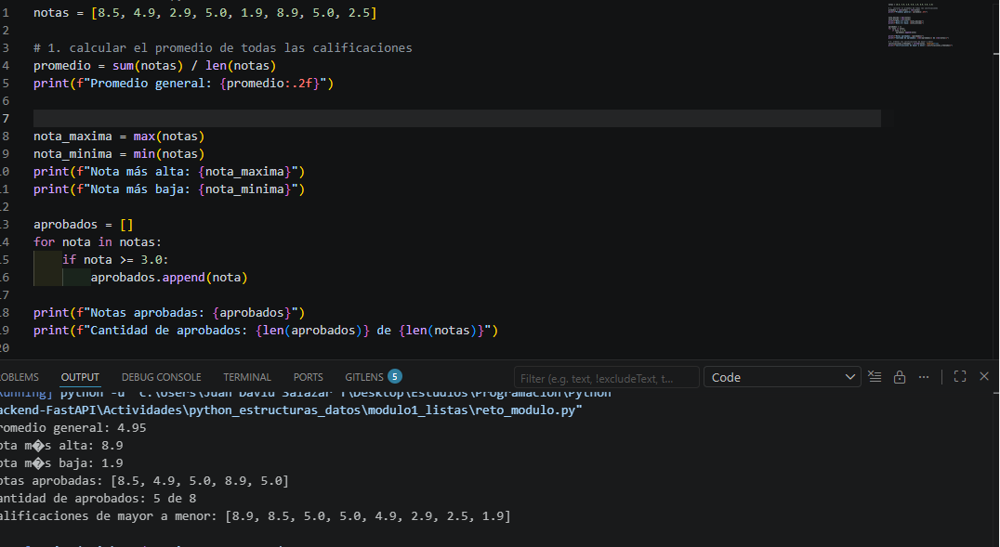
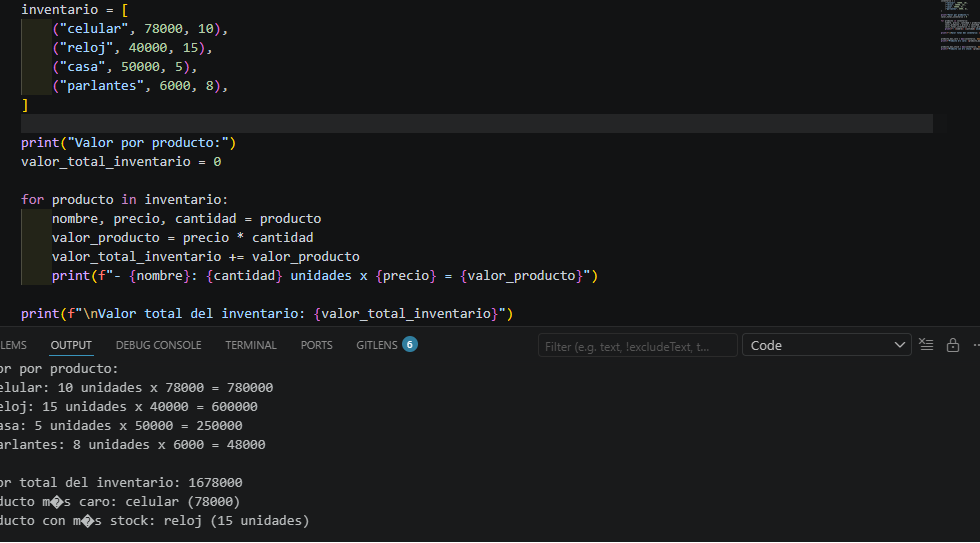
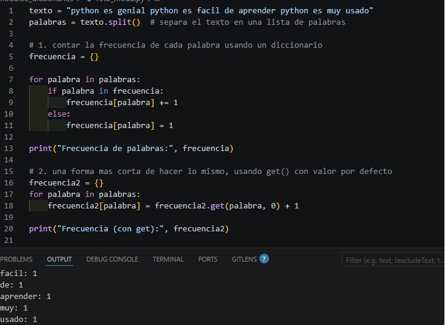
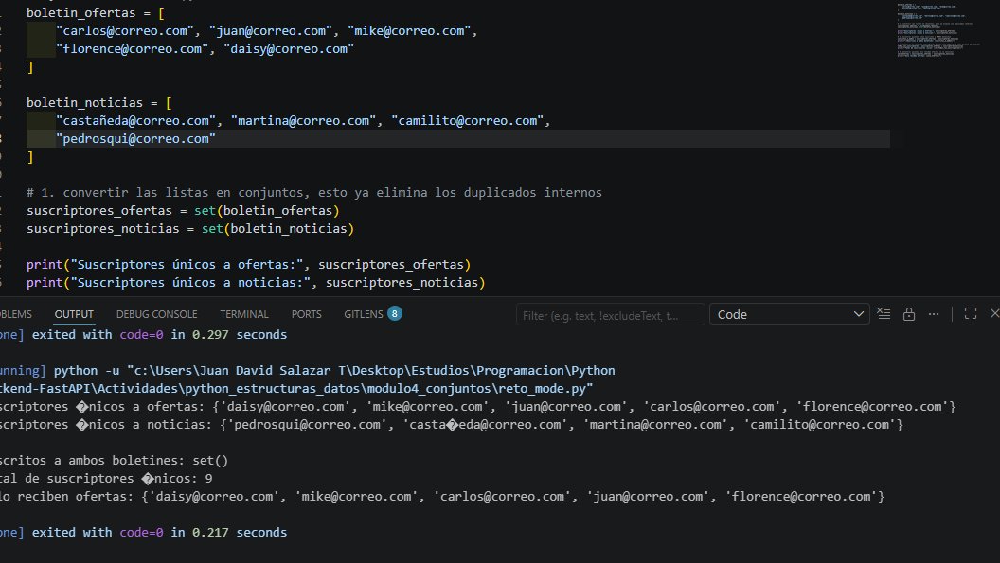

JUAN DAVID SALAZAR TORRES

FICHA:3169901

ANALISIS Y DESARROLLO DE SOFTWARE

CTMA:SENA

¿Descripcion del proyecto?

Este proyecto enseña todos sobre listas, tuplas, diccionarios, conjuntos y comprehensions en python,basado incluso en una documentacion se da una orientacion.

Estructura de datos python

Imagenes de prueba

Modulo_1:

Reto:

Modulo_2:

Reto:

Modulo_3:

Reto:

Modulo_4:

Reto:

REFLEXION:

Esta actividad me deja como evidencia que no todo se pueden tratar de la misma forma en python.

